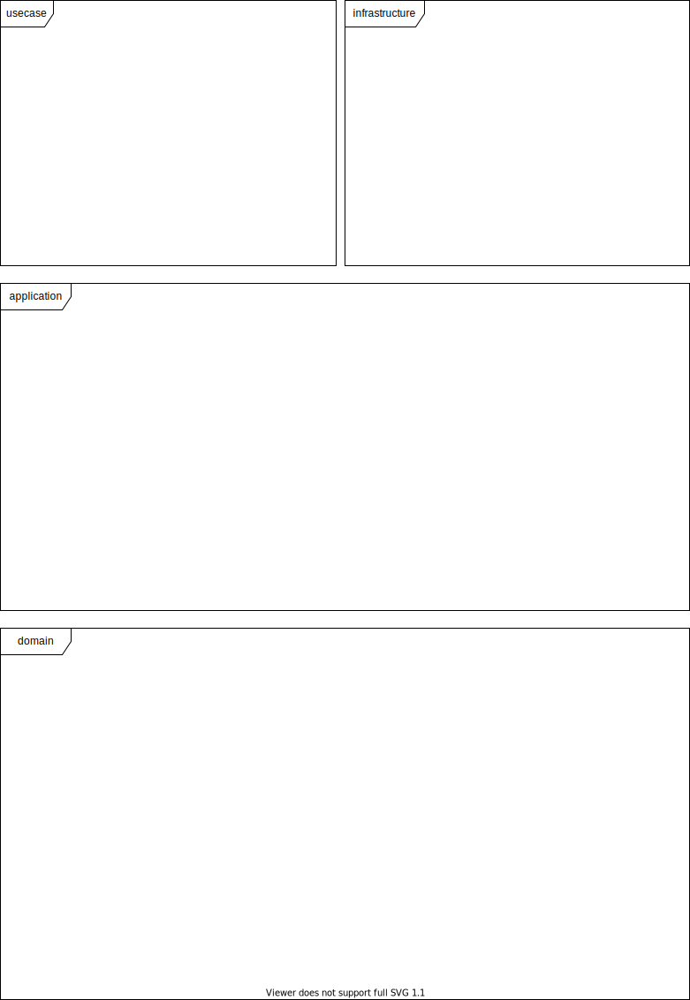

Class diagram
============================================

.. note::
   The point to design the class structure is to **limit direction of dependency**.
   The layered view in the figure, which is called the **layered architecture**,
   would be a good guide to building such class structure.
   You can refer only from top to bottom, and never from bottom to top.

