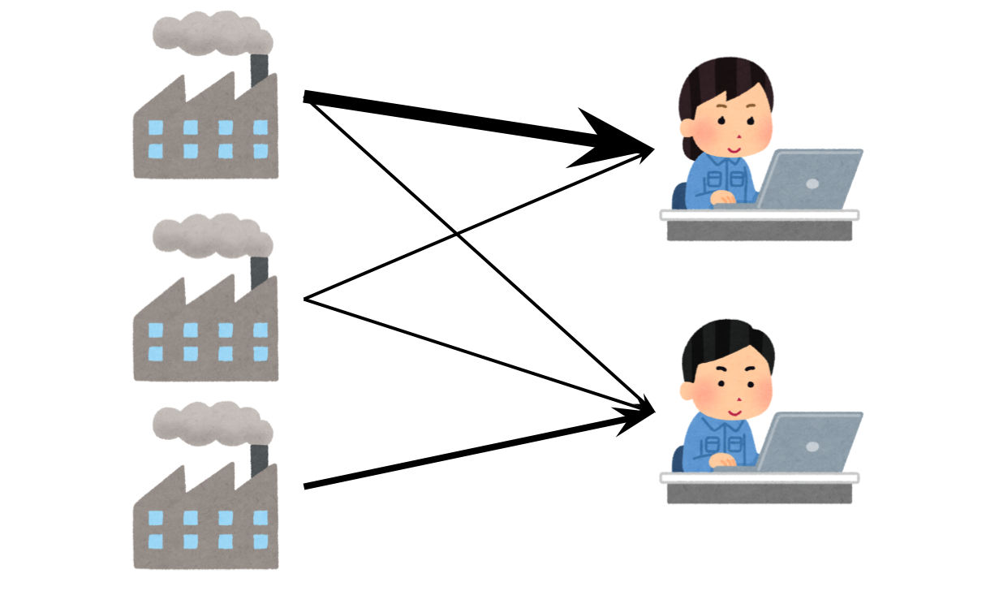

Optimization
============================================

In this example, we pose a simple MILP model that solves a transportation problem.
Given the demand of each customer, the production cost in each factory, and the transportation cost from each factory to each customer,
we want to find the best production & transportation pattern that minimizes the total cost of goods sold.

.. toctree::
   :maxdepth: 1
   :hidden:

   sets
   constants
   variables
   objectives
   constraints
